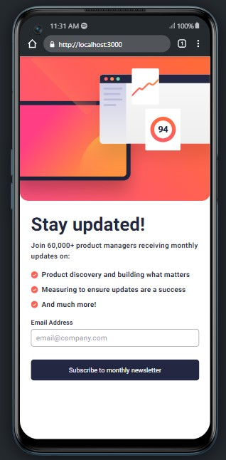

# Frontend Mentor - Newsletter sign-up form with success message solution

This is a solution to the [Newsletter sign-up form with success message challenge on Frontend Mentor](https://www.frontendmentor.io/challenges/newsletter-signup-form-with-success-message-3FC1AZbNrv). Frontend Mentor challenges help you improve your coding skills by building realistic projects.

## Overview

### The challenge

Users should be able to:

- Add their email and submit the form
- See a success message with their email after successfully submitting the form
- See form validation messages if:
  - The field is left empty
  - The email address is not formatted correctly
- View the optimal layout for the interface depending on their device's screen size
- See hover and focus states for all interactive elements on the page

### Screenshot

#### Desktop mock

  

  

#### Mobile mock

  

  
  

### Links

- Solution URL: [Add solution URL here](https://your-solution-url.com)
- Live Site URL: [Add live site URL here]([https://your-live-site-url.com](https://newsletter-kuwlup9ew-acerng548.vercel.app))

## My process

### Built with

-
- CSS custom properties
- Flexbox
- CSS Grid
- Desktop-first workflow
- [Next.js](https://nextjs.org/) - React framework
- [TailwindCss](https://tailwindcss.com) - For styles

## Author

- Frontend Mentor - [@AcerNg548](https://www.frontendmentor.io/profile/AcerNg548)
- Twitter - [@AcerNg548](https://www.twitter.com/AcerNg548)
